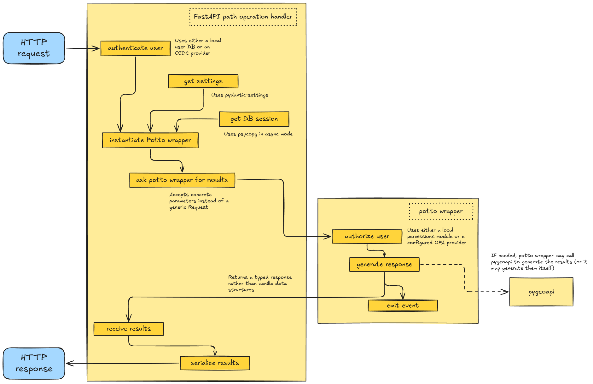

# Potto - the pygeoapi primate

An opinionated starlette+fastapi application that wraps pygeoapi.

## Early technical overview

A typical API request cycle looks like:

The path operation handler takes the HTTP request and performs user authentication. Then is asks the potto wrapper to
generate results. The wrapper performs user authorization and generates a response. This may involve reaching out to
pygeoapi. In any case, the potto wrapper:

- accepts async calls
- returns typed objects

The generated response is then serialized by the web application handler to whatever output format, if needed

This architecture means that potto is able to pre-process requests, enhance the cycle with auth-related features,
then leverage pygeoapi for the generation of results (while at the same time being able to implement its own business
logic if needed) and finally take the results and render them.
